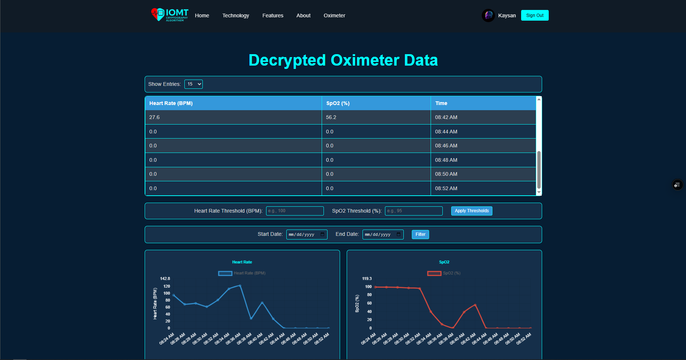
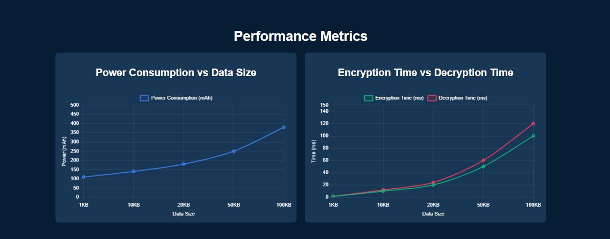
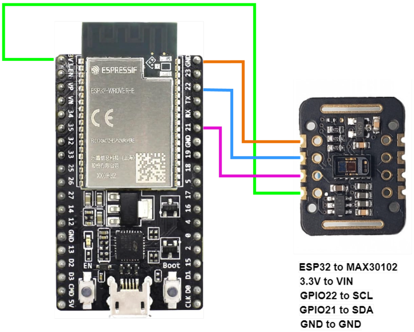

# 🔒 Encryption Algorithm in IoMT


Welcome to **Encryption_Algorithem_in_IoMT**, a secure Internet of Medical Things (IoMT) solution that integrates ESP32 with MAX30102 sensors to collect heart rate and SpO2 data, encrypts it using AES-256, and visualizes the decrypted data through a React-based web application. This project focuses on secure data transmission, real-time monitoring, and performance analysis of encryption/decryption processes.

---

## 📖 Project Overview

This project demonstrates a secure IoMT framework for healthcare applications. It uses an ESP32 board with a MAX30102 sensor to collect vital signs, encrypts the data with AES-256, and sends it to a Flask server for decryption. The decrypted data is stored in Firebase and visualized through a React frontend, providing real-time insights and performance metrics like power consumption, encryption, and decryption times.

---

## ✨ Features

- **Secure Data Transmission**: Implements AES-256 encryption for data collected from the MAX30102 sensor.
- **Real-Time Monitoring**: Displays heart rate and SpO2 data using interactive charts.
- **Performance Metrics**: Visualizes power consumption, encryption, and decryption times for different data sizes.
- **Firebase Integration**: Stores and retrieves decrypted data in real-time.
- **Responsive UI**: Includes a user-friendly interface with filtering options for data visualization.
- **Contact Us Popup**: Easily accessible contact information for the project team.

---

## 📸 Screenshots

### Oximeter Data Dashboard


### Performance Metrics


### Hero Section


*Note*: Add actual screenshots to the `screenshots/` folder and update the paths above.

---

## 🛠️ Installation

### Prerequisites
- **Node.js** and **npm** (for React frontend)
- **Python 3.x** (for Flask backend)
- **Arduino IDE** (for ESP32 firmware)
- **Firebase Account** (for real-time database)
- **ESP32 Board** and **MAX30102 Sensor**

### Steps
1. **Clone the Repository**
   ```bash
   git clone https://github.com/AbdulMalik9876/Encryption_Algorithem_in_IoMT.git
   cd Encryption_Algorithem_in_IoMT
   ```

2. **Set Up the Frontend**
   ```bash
   cd Encryption_Algorithem_in_IoMT
   npm install
   ```
   - Configure Firebase in `src/firebase.js` with your credentials.
   - Run the development server:
     ```bash
     npm start
     ```

3. **Set Up the Backend**
   ```bash
   cd backend
   pip install -r requirements.txt
   ```
   - Ensure you have the required Python libraries (e.g., `Flask`, `Crypto`).
   - Run the Flask server:
     ```bash
     python decryption.py
     ```

4. **Set Up the ESP32**
   - Open the ESP32 firmware code (e.g., `esp32_max30102.ino`) in Arduino IDE.
   - Install the required libraries (e.g., MAX30102, WiFi, AES).
   - Upload the code to your ESP32 board connected to the MAX30102 sensor.
    

5. **Configure Firebase**
   - Set up a Firebase project and enable the Realtime Database.
   - Update the `chipId` in the frontend to match your ESP32 device.

---

## 🚀 Usage

1. **Start the Flask Server**
   - Run the backend server to handle decryption and data forwarding to Firebase.
     ```bash
     cd backend
     python decryption.py
     ```

2. **Run the ESP32**
   - Power on the ESP32 with the MAX30102 sensor connected.
   - Ensure it’s connected to the same network as the Flask server.
   - The ESP32 will collect heart rate and SpO2 data, encrypt it, and send it to the server.

3. **Launch the Frontend**
   - Start the React app:
     ```bash
     cd Encryption_Algorithem_in_IoMT
     npm start
     ```
   - Open `http://localhost:3000` in your browser.
   - Navigate to the Oximeter Data section to view real-time heart rate and SpO2 data.
   - Check the Metrics section for performance charts.

4. **Filter Data**
   - Use the date and threshold filters in the Oximeter Data section to customize the displayed data.

---

## 🧰 Tools and Technologies

| **Category**       | **Tools/Languages**          |
|---------------------|------------------------------|
| **Frontend**        | ⚛️ React, 🌐 JavaScript, 🎨 CSS, 📊 Chart.js (`react-chartjs-2`) |
| **Backend**         | 🐍 Flask, 🐍 Python, 🔒 Crypto (AES) |
| **ESP32 Firmware**  | 💻 C++, 🤖 Arduino, 🔧 ESP32, 🩺 MAX30102 |
| **Database**        | 🔥 Firebase Realtime Database |
| **Encryption**      | 🔐 AES-256 |
| **Version Control** | 🗃️ Git |

---

## 📂 Project Structure

```
Encryption_Algorithem_in_IoMT/
├── backend/                   # Flask server for decryption
│   ├── app.py                 # Main Flask application
│   └── requirements.txt       # Python dependencies
├── esp32/                     # ESP32 firmware code
│   └── esp32_max30102.ino     # ESP32 code for MAX30102 sensor
├── frontend/                  # React frontend
│   ├── src/                   # Source files
│   │   ├── components/        # React components
│   │   │   ├── About.js
│   │   │   ├── CloudinaryUpload.js
│   │   │   ├── ContactUsPopup.js
│   │   │   ├── Features.js
│   │   │   ├── Footer.js
│   │   │   ├── Hero.js
│   │   │   ├── Highlights.js
│   │   │   ├── Home.js
│   │   │   ├── Login.js
│   │   │   ├── Metrics.js
│   │   │   ├── Navbar.js
│   │   │   ├── OximeterData.js
│   │   │   ├── Profile.js
│   │   │   ├── ProtectedRoute.js
│   │   │   ├── Signup.js
│   │   │   ├── Team.js
│   │   │   └── Technology.js
│   │   │   ├── styles/        # CSS styles
│   │   │   │   ├── About.css
│   │   │   │   ├── ContactUsPopup.css
│   │   │   │   ├── Features.css
│   │   │   │   ├── Footer.css
│   │   │   │   ├── Hero.css
│   │   │   │   ├── Highlights.css
│   │   │   │   ├── Home.css
│   │   │   │   ├── Login.css
│   │   │   │   ├── Metrics.css
│   │   │   │   ├── Navbar.css
│   │   │   │   ├── OximeterData.css
│   │   │   │   ├── Profile.css
│   │   │   │   ├── Signup.css
│   │   │   │   ├── Team.css
│   │   │   │   └── Technology.css
│   │   ├── assets/            # Images and static assets (root level)
│   │   └── firebase.js        # Firebase configuration
│   ├── public/                # Public assets
│   └── package.json           # Node.js dependencies
├── screenshots/               # Screenshots for README
└── README.md                  # Project documentation
```

---

## 🤝 Contributing

Contributions are welcome! To contribute:
1. Fork the repository.
2. Create a new branch (`git checkout -b feature/your-feature`).
3. Make your changes and commit (`git commit -m "Add your feature"`).
4. Push to your branch (`git push origin feature/your-feature`).
5. Create a pull request.

---

## 📬 Contact

For inquiries, reach out to the project team:

- **Abdul Malik** (Founder)  
  Email: amabbaxi9876@gmail.com  
  Phone: +92-318-0971788

- **M. Hassan Mehmood** (Co-Founder)  
  Email: mhassankhokhar476@gmail.com  
  Phone: +92-349-9194480

---

## 📜 License

This project is licensed under the MIT License. See the [LICENSE](LICENSE) file for details.

---

⭐ **If you find this project useful, give it a star on GitHub!** ⭐
```